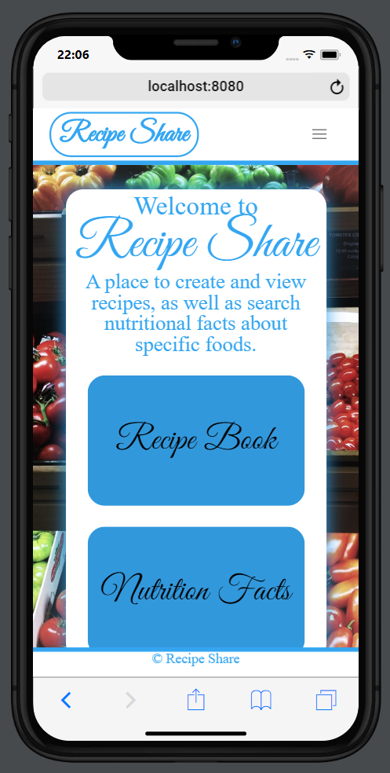

 

  </img>

 
"I don't want to spend my life not having good food going into my pie hole. That hole was made for pies." - Paula Deen.

 

This deployed application can be viewed at : 

Made with HTML handlebars and Bulma CSS powered by Sequelize, MySQL Database along with the API Edamam. This application allows users to view, create and share recipes with others as well as give nutritional facts about specific foods. The scope of this project was to implement full fuctionality of an application using ORMs such as handlebars for the HTML as well as connecting an API and database using MySQL. The basic structure of the website can be viewed below.

  </img>

The user will be initially prompted to either view/create recipes or search nutritional facts. When a user clicks on the nutritional facts they will be able to search any food they are wanting to find information on and append a list of nutritional facts about the food. This information is found using our API from Edamam.

If the user selects the recipe they will be given the opportunity to either add there own recipe to the database or view already posted recipes on the application database. This database was made using MySQL. 

<h3>Future Development</h3>

- Add more functionality to the database side of the application allowing the user to search for recipes or find recipes by different categories.

- Continue UI build out for clean mobile first use.

- Add functionality of the API to the database for a better user experience.